# B2B Ecommerce Application in MERN Stack and TypeScript

## Overview

This repository contains the codebase for a comprehensive B2B and B2C E-commerce application. The project is divided into three main applications:

1. **Client Application (ReactJS and other technologies)**
2. **Server Application (API) - NodeJS, Express, JWT, Postgresql, Sequelize ORM, etc.**
3. **Admin Dashboard (TypeScript, Tailwind, and other related technologies for graphs and charts.)**

## Features

- **Client Application:**
  - Intuitive and responsive user interface for seamless shopping experiences.
  - Advanced product search and filtering capabilities.
  - User authentication and authorization for personalized experiences.
  - Cart management and order processing functionality.

**Client Application Screenshots:**
  - 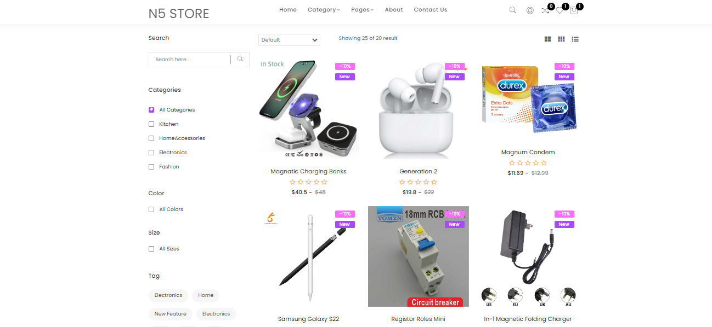
  - 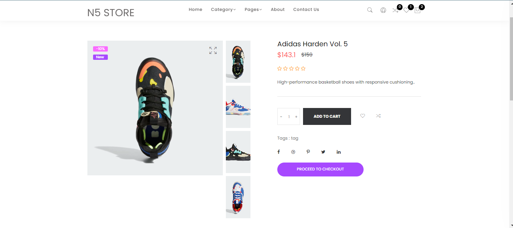
  - 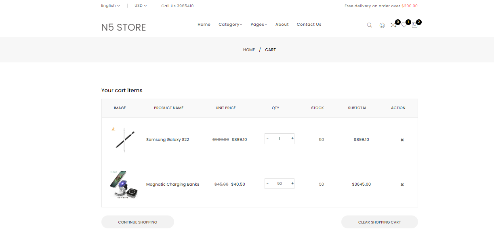
  - 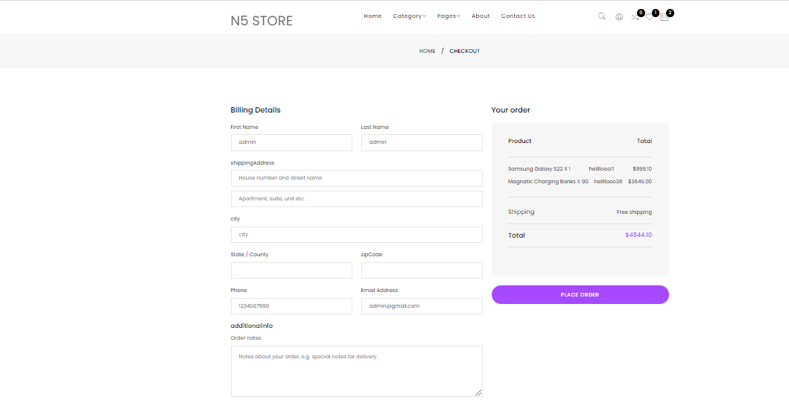
    

- **Server Application (API):**
  - Robust backend architecture powered by NodeJS and Express.
  - Secure authentication using JSON Web Tokens (JWT).
  - Database integration with Postgresql and Sequelize ORM for efficient data handling.
  - RESTful API endpoints for seamless communication between client and server.
  - Scalable and modular codebase for easy maintenance and updates.
 
    **Client Application Screenshots:**
  - 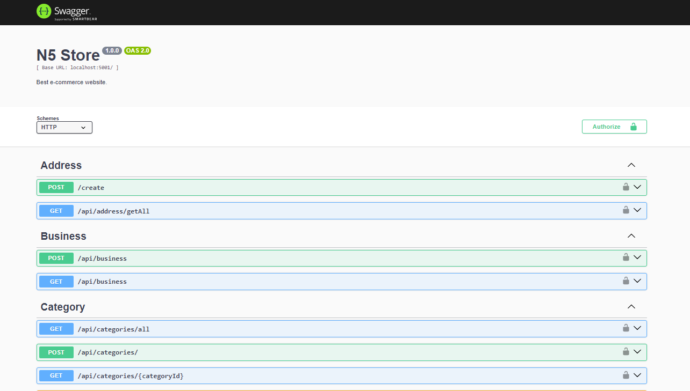
  - 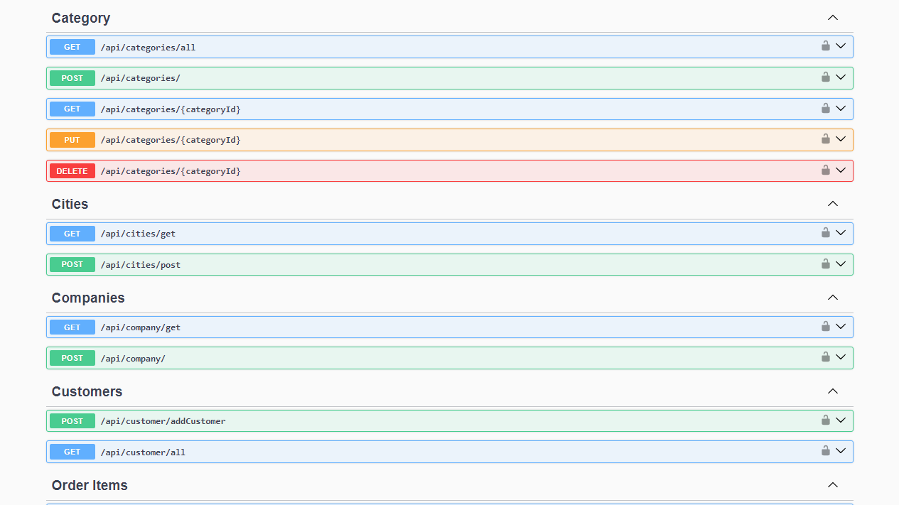
  - 
  - 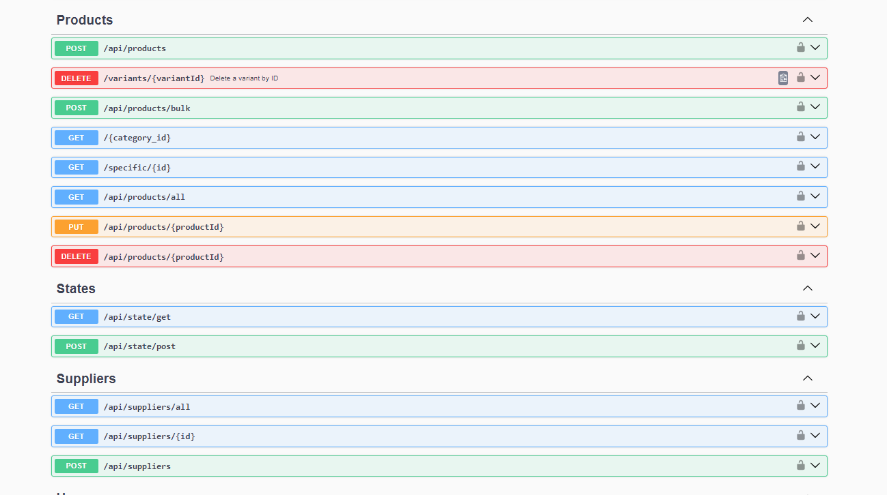
  - 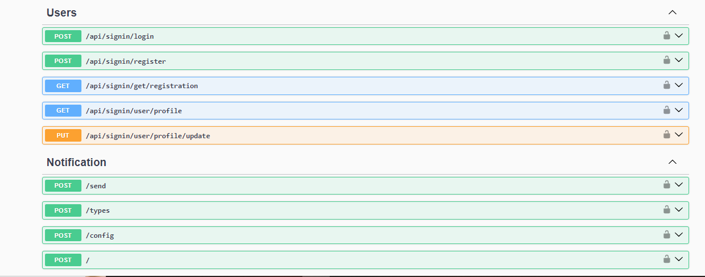
    

- **Admin Dashboard:**
  - Powerful admin dashboard built with TypeScript.
  - Data visualization using Tailwind and other related technologies for graphs and charts.
  - User management and access control features.
  - Comprehensive insights into sales, user activities, and other key metrics.

  **Admin Application Screenshots:**
  - 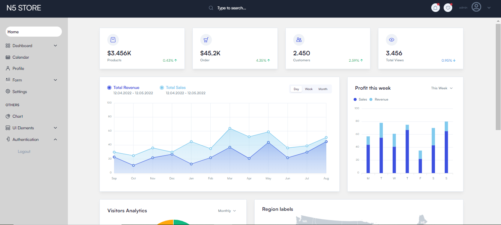
  - 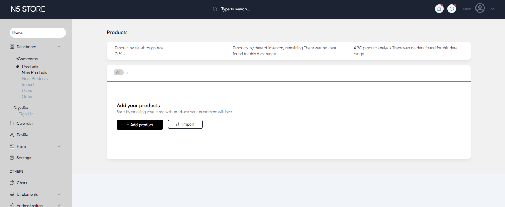
  - 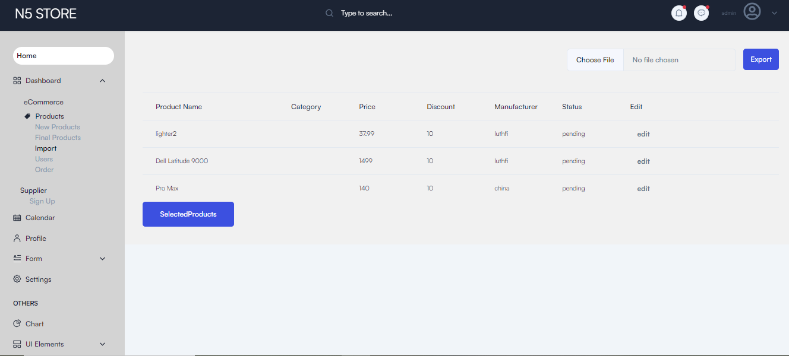
  - 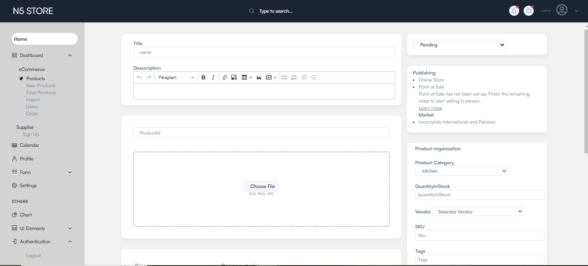
  - 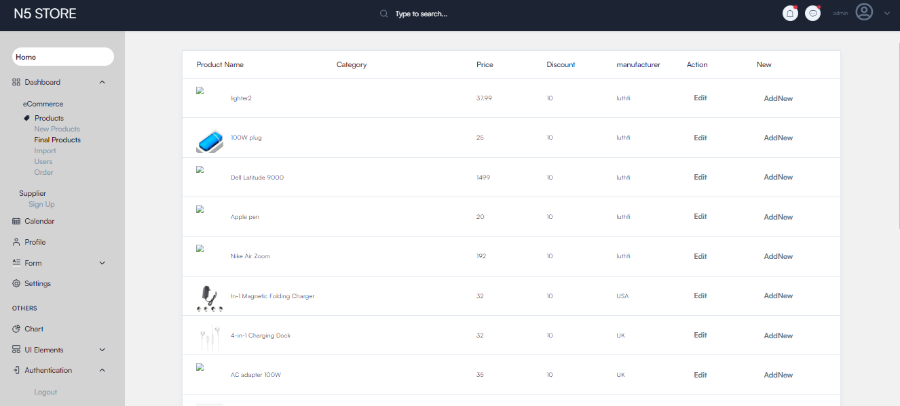
  - 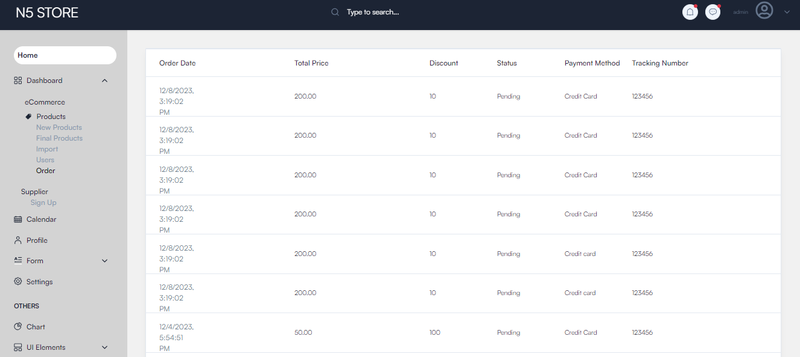
    

## Prerequisites

Ensure you have the following software installed on your machine:

- Node.js
- npm or yarn
- PostgreSQL

## Getting Started

### Client Application

1. Navigate to the `client` directory.
2. Run `npm install` or `yarn install` to install dependencies.
3. Configure environment variables as needed.
4. Run `npm start` or `yarn start` to launch the client application.

### Server Application

1. Navigate to the `server` directory.
2. Run `npm install` or `yarn install` to install dependencies.
3. Configure environment variables such as database connection details and JWT secret.
4. Run `npm start` or `yarn start` to start the server.

### Admin Dashboard

1. Navigate to the `admin-dashboard` directory.
2. Run `npm install` or `yarn install` to install dependencies.
3. Configure environment variables if necessary.
4. Run `npm start` or `yarn start` to launch the admin dashboard.

## Contributing

Feel free to contribute to the project by opening issues, providing feedback, or submitting pull requests. See our [Contribution Guidelines](CONTRIBUTING.md) for more details.

## License

This project is licensed under the [MIT License](LICENSE.md).
